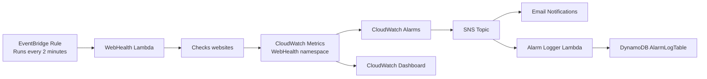

# Joshua AWS Website Health Monitoring

This project is an AWS Cloud Development Kit (CDK) solution for monitoring the availability, latency, and HTTP response status of university and public websites. It continuously checks key web endpoints, publishes custom metrics to CloudWatch, triggers alarms when thresholds are breached, and stores alarm details in DynamoDB for auditing and troubleshooting.

## Project Purpose

The purpose of this project is to provide an automated website monitoring system in AWS. It helps track the health of critical web services by measuring:

- Availability of each site
- Response time or latency
- HTTP status codes returned by the site

The solution is designed for ongoing monitoring and operational awareness, especially for high-importance university and public web services.

## AWS Architecture

The infrastructure is defined in the CDK stack in `joshua/joshua_stack.py`. The architecture combines several AWS services:

- EventBridge schedule triggers a Lambda function every 2 minutes
- Lambda checks the configured websites
- CloudWatch stores custom metrics
- CloudWatch alarms evaluate metric thresholds
- SNS publishes notifications when an alarm fires
- DynamoDB stores alarm records for later review
- CloudWatch dashboard visualises key website metrics



### Main AWS Components

- `WebHealthLambda` monitors websites and writes metrics to CloudWatch
- `AlarmLoggerLambda` processes SNS alarm notifications and writes them to DynamoDB
- `LambdaInvocationRule` invokes the monitoring Lambda on a two-minute schedule
- `AlarmLogTable` stores alarm metadata and raw notification payloads
- `AlarmNotifications` SNS topic handles email and Lambda-based alarm subscription actions
- `WebHealthMonitoring` CloudWatch dashboard visualises key metrics

## Lambda Functions

### 1. WebHealth Lambda

The function in `joshua/resources/webhealth.py` performs the monitoring checks.

It:

- Defines a list of URLs to inspect
- Opens each URL using Python's `urllib` library
- Measures the response time from the request start to completion
- Records the HTTP status code returned by the server
- Marks availability as `1` when the request succeeds and `0` otherwise
- Pushes the metrics to CloudWatch under the `WebHealth` namespace

The code currently monitors the following URLs:

- `https://www.westernsydney.edu.au/`
- `https://www.unsw.edu.au/`
- `https://www.sydney.edu.au/`

The custom metrics are defined in `joshua/resources/constants.py`:

- `AVAILABILITY_METRIC`
- `LATENCY_METRIC`
- `HTTP_STATUS_CODE`

The helper used to send the metrics is in `joshua/resources/CWPutData.py`.

### 2. Alarm Logger Lambda

The function in `joshua/resources/alarm_logger.py` handles CloudWatch alarm messages from an SNS topic.

It:

- Reads the SNS message payload
- Parses the JSON alarm data
- Stores the alarm details in DynamoDB

This allows alarm activity to be retained for later analysis.

## CloudWatch Metrics

The project uses a custom CloudWatch namespace named `WebHealth` and publishes metrics with the `URL` dimension so each site can be monitored separately.

### Metrics

1. `AVAILABILITY_METRIC`
   - Binary metric: `1` means available, `0` means unavailable
   - Unit: `None`

2. `LATENCY_METRIC`
   - Measures how long the website takes to respond
   - Unit: `Seconds`

3. `HTTP_STATUS_CODE`
   - Captures the HTTP status code returned by the site
   - Unit: `Count`

These metrics are stored in CloudWatch and used for dashboards and alarms.

## CloudWatch Alarms

The stack defines three alarms in `joshua/joshua_stack.py`:

### Website Availability Alarm

- Alarm name: `WebsiteAvailabilityAlarm`
- Trigger: availability falls below `0.9`
- Evaluation periods: `2`
- Missing data handling: `BREACHING`
- Purpose: detects a significant outage or a site that is not responding as expected

### Website Latency Alarm

- Alarm name: `WebsiteLatencyAlarm`
- Trigger: latency exceeds `2` seconds
- Evaluation periods: `2`
- Missing data handling: `BREACHING`
- Purpose: detects slow website performance

### HTTP Status Alarm

- Alarm name: `WebsiteHttpStatusAlarm`
- Trigger: HTTP status code exceeds `400`
- Evaluation periods: `2`
- Missing data handling: `BREACHING`
- Purpose: detects 4xx and 5xx errors

Each alarm is connected to the SNS topic, which sends notifications.

## SNS Notifications

The project creates an SNS topic named `AlarmNotifications`.

It is configured to:

- Send email notifications to the configured address
- Trigger the `AlarmLoggerLambda` to record alarm information in DynamoDB

This provides both real-time notification and persistent alarm history.

## DynamoDB Alarm Logging

The table `AlarmLogTable` stores alarm events emitted by CloudWatch alarms.

The schema includes:

- `alarm_name` (partition key)
- `state_change_time` (sort key)
- `new_state`
- `reason`
- `region`
- `account_id`
- `raw_message`

This makes it easier to review:

- when an alarm fired
- why it fired
- whether the issue was an outage, latency problem, or HTTP error
- the raw details contained in the original notification

## CloudWatch Dashboard

A dashboard named `WebHealthMonitoring` is created with widgets for:

- Website Availability
- Website Latency
- HTTP Status Codes

This gives a visual overview of the health of the monitored website endpoints in a single AWS dashboard.

## Deployment and Setup Instructions

### Prerequisites

Before deploying the project, you should have:

- Python 3.x
- Node.js and npm
- AWS CLI configured with valid AWS credentials
- AWS CDK installed globally

### Install AWS CDK

```bash
npm install -g aws-cdk
```

### Fork and Clone the Repository

1. Log in to your GitHub account.
2. Fork the repo: https://github.com/AyeshaOmer/WSU2026.git
3. Copy the web URL of your fork.
4. Clone the forked repo:

```bash
git clone <your_fork_url>
```

5. Create your project folder in the repo:

```bash
mkdir <your_name>
cd <your_name>
```

6. Initialise a Python CDK project:

```bash
cdk init --language python
```

7. Activate the virtual environment:

On macOS/Linux:

```bash
source .venv/bin/activate
```

On Windows PowerShell:

```powershell
.\.venv\Scripts\Activate.ps1
```

8. Install project dependencies:

```bash
python -m pip install -r requirements.txt
```

### Deploy the Stack

From the project folder, run:

```bash
cdk synth
cdk deploy
```

This synthesises the CloudFormation stack and deploys the AWS infrastructure to your configured AWS account and region.

### Useful CDK Commands

```bash
cdk ls
cdk synth
cdk diff
cdk deploy
```

## Repository Structure

```text
.
├── app.py
├── cdk.json
├── README.md
├── requirements.txt
├── requirements-dev.txt
├── source.bat
├── joshua/
│   ├── __init__.py
│   ├── joshua_stack.py
│   └── resources/
│       ├── CWPutData.py
│       ├── alarm_logger.py
│       ├── constants.py
│       └── webhealth.py
├── tests/
│   └── unit/
│       └── test_joshua_stack.py
└── .venv/
```

## Notes

- The project uses `WebHealth` as the custom CloudWatch namespace.
- The monitoring rule runs every 2 minutes.
- SNS email subscriptions may require confirmation before email alerts are delivered.
- Ensure your AWS credentials and default region are configured correctly before deployment.

## Summary

This project demonstrates a practical AWS monitoring solution built with Python CDK. It combines scheduled website checks, custom CloudWatch metrics, alarm thresholds, SNS notifications, DynamoDB logging, and a dashboard to give a clear operational view of website health across multiple public endpoints.
